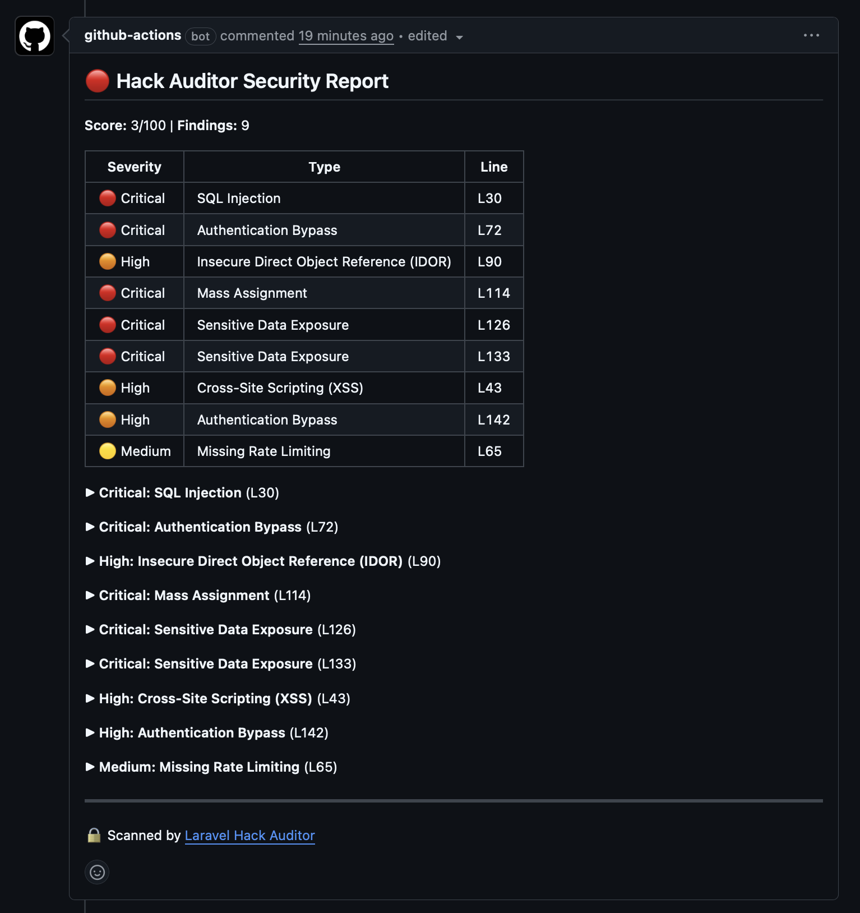

<p align="center">
  
</p>

<h3 align="center">AI security scanning for every pull request.</h3>

<p align="center">
  <a href="https://github.com/mahdi-salmanzade/laravel-hack-auditor-action"></a>
  <a href="https://github.com/mahdi-salmanzade/laravel-hack-auditor"></a>
  <a href="https://github.com/mahdi-salmanzade/laravel-hack-auditor/blob/main/LICENSE"></a>
</p>

Scans only the files changed in a PR, posts findings as **inline annotations** on the exact vulnerable lines, and leaves a summary comment — all in under a minute.

## What your PR will look like

<p align="center">
  
</p>

Critical and high findings also appear as **error annotations** inline in the "Files changed" tab — developers see them without leaving the review flow.

## Quickstart (5 lines)

**1. Add your API key** as a repository secret: Settings → Secrets → `ANTHROPIC_API_KEY`

**2. Create** `.github/workflows/security-scan.yml`:

```yaml
name: Security Scan
on:
  pull_request:
    branches: [main]

permissions:
  contents: read
  pull-requests: write

jobs:
  hack-auditor:
    runs-on: ubuntu-latest
    steps:
      - uses: actions/checkout@v4
        with:
          fetch-depth: 0

      - uses: shivammathur/setup-php@v2
        with:
          php-version: '8.4'

      - run: composer install --no-interaction --prefer-dist

      - uses: mahdi-salmanzade/laravel-hack-auditor-action@v1
        with:
          api-key: ${{ secrets.ANTHROPIC_API_KEY }}
```

That's it. Every PR now gets an AI security review.

## Inputs

| Input | Required | Default | Description |
|-------|----------|---------|-------------|
| `api-key` | **Yes** | — | API key for your AI provider |
| `provider` | No | `anthropic` | AI provider: `anthropic`, `openai`, or `gemini` |
| `model` | No | Provider default | Specific model (e.g., `claude-sonnet-4-6`, `gpt-4o`) |
| `severity` | No | `low` | Minimum severity to report: `low`, `medium`, `high`, `critical` |
| `fail-on` | No | `none` | Fail the check at this severity+: `none`, `low`, `medium`, `high`, `critical` |
| `base-branch` | No | Auto-detect | Base branch for diff (defaults to `main`/`master`) |
| `scan-path` | No | All scan paths | Specific file or directory to scan |
| `github-token` | No | `${{ github.token }}` | Token for posting PR comments |
| `install-package` | No | `true` | Install hack-auditor via Composer before scanning |
| `token-limit` | No | Unlimited | Maximum token budget for the scan |

## Outputs

Use these in downstream steps with `${{ steps.<id>.outputs.<name> }}`:

| Output | Example | Description |
|--------|---------|-------------|
| `score` | `75` | Overall security score (0–100) |
| `total` | `4` | Total findings |
| `critical` | `1` | Critical findings |
| `high` | `2` | High findings |
| `medium` | `1` | Medium findings |
| `low` | `0` | Low findings |
| `json_path` | `.hack-auditor-results.json` | Path to raw JSON results |

## Provider setup

The action supports three AI providers. Set **one** secret:

| Provider | Secret name | Input |
|----------|-------------|-------|
| Anthropic | `ANTHROPIC_API_KEY` | `provider: anthropic` |
| OpenAI | `OPENAI_API_KEY` | `provider: openai` |
| Google Gemini | `GEMINI_API_KEY` | `provider: gemini` |

```yaml
- uses: mahdi-salmanzade/laravel-hack-auditor-action@v1
  with:
    api-key: ${{ secrets.OPENAI_API_KEY }}
    provider: openai
    model: gpt-4o
```

## Gradual rollout with `fail-on`

Start non-blocking, then tighten as your team cleans up:

```yaml
# Week 1 — just report, never block
fail-on: none

# Week 2 — block on critical only
fail-on: critical

# Week 4 — block on high+
fail-on: high

# Steady state — block on everything
fail-on: low
```

## Advanced examples

### Only scan controllers, fail on high+

```yaml
- uses: mahdi-salmanzade/laravel-hack-auditor-action@v1
  with:
    api-key: ${{ secrets.ANTHROPIC_API_KEY }}
    severity: medium
    fail-on: high
    scan-path: app/Http/Controllers
```

### Use outputs in a later step

```yaml
- uses: mahdi-salmanzade/laravel-hack-auditor-action@v1
  id: audit
  with:
    api-key: ${{ secrets.ANTHROPIC_API_KEY }}

- name: Notify Slack on critical
  if: steps.audit.outputs.critical > 0
  run: |
    curl -X POST "$SLACK_WEBHOOK" \
      -d "{\"text\":\"🔴 ${steps.audit.outputs.critical} critical vulnerabilities in PR #${{ github.event.pull_request.number }}\"}"
```

### Budget token usage

```yaml
- uses: mahdi-salmanzade/laravel-hack-auditor-action@v1
  with:
    api-key: ${{ secrets.ANTHROPIC_API_KEY }}
    token-limit: '50000'
```

### Skip install (already a dev dependency)

```yaml
- uses: mahdi-salmanzade/laravel-hack-auditor-action@v1
  with:
    api-key: ${{ secrets.ANTHROPIC_API_KEY }}
    install-package: 'false'
```

## How it works

```
PR push → checkout → composer install → hack:scan --json --diff --force
                                              ↓
                              Only changed PHP files are scanned
                                              ↓
                         Findings → inline annotations + PR comment
                                              ↓
                           fail-on threshold → pass or fail the check
```

The `--diff` flag uses `git diff` to find PHP files changed between the PR branch and base branch. Only files in configured scan paths (controllers, models, routes, middleware, requests) are analyzed. No `.env` file is needed — the API key is passed as a real environment variable, which Laravel reads natively.

## Requirements

- PHP 8.3+ and Composer available in the runner
- The Laravel app must be bootable (`php artisan` must work)
- `jq` available in the runner (pre-installed on `ubuntu-latest`)
- `fetch-depth: 0` on checkout (needed for `git diff` across branches)

## License

MIT — same as [Laravel Hack Auditor](https://github.com/mahdi-salmanzade/laravel-hack-auditor).
